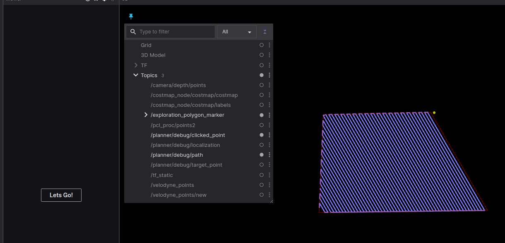

Mower Robot software

Installation:
-----------------------
Clone the repository
! contains submodules
git submodule update --init --recursive
! this command is also included in all/run_all.sh

Start up:
-----------------------
There are several modules need to be started depending of required functionality:

use all/run_all.sh for experiments

expmple:
cd all
bash run_all.sh --sim --rviz --mb_mod --segm --loca --proj --mb_mod

args are:
- --sim   - gazebo
- --rviz  - rviz
- --mb_mod - move_bas_mod (motion controller)
- --segm  - segmanetation
- --loca  - A-LOAM localization (used with sim only)
- --proj  - projection (of segmentation data to grid costmap)
- --teleop - run teleop (run it in a separate window)

OBSOLETE:
1. simulation/run_sim.sh  - starts gazebo simulation with virtual robot model
2. etc

launcher.sh - common launcher script for all submodules

using docker registry
------------------------
You can use docker registry to split build and run stages.
1. docker login -u=testuser -p=testpassword kan-rt.ddns.net:5043
2. docker tag yourimage:latest kan-rt.ddns.net:5043/yourimage:latest
docker push

Planning
------------------------
### Usage
Run planning modules with roslaunch command:
```
roslaunch my_utils_common all.launch planning:=true
```

We can use script test_planning.py for publish coverage planning task and task go to point:
```
cd catkin_ws/src
cd planning/planning_tests/scripts/

# publish task go to point
python3 test_planning.py --point 1.0 2.0

# publish task go to point
python3 test_planning.py --polygon 1.0,2.0 3.0,5.0 7.0,6.0
```

Also we can use ui app for publish task to point:
```
cd catkin_ws/src
cd planning/planning_tests/scripts/

python3 planner_plot.py
```

Then we can double click to any point at plot and script publish task to that point.


rtabmap
--------------------------
bash run_all.sh --sim --robot turtlebot3 world:=playpen
bash run_all.sh --rtabmap rtabmapviz:=true
bash run_all.sh --rviz
bash run_all.sh --teleop


Go button test
--------------------------
тест отрисовки полигона в foxglove, и запуске робота по пути кнопкой Go

! git submodule update --init --recursive отключен в run_all.cmd, теперь надо делать вручную. Это чтобы не сбрасывать версию субмодуля при разработке.

запускаем след. ноды:
run_all.sh --sim --robot ya_model
run_all.sh --planning
run_all.sh backend:=true
run_all.sh --rosbridge
run_all.sh --studio

открываем foxglove в хроме по адресу http://localhost:8080
на 3d панели включаем визуализацию топиков:
    /exploration_polygon_marker
    /planner/debug/clicked_point
    /planner/debug/path

добавляем панель "Mower" из доступного набора панелей

рисуем полигон инстрментом "точка" в координатах "odom", последовательно кликая не менее 3х точек. По завершении кликнуть на начальную точку, чтобы полигон стал красным.

Нажимаем кнопку Go на панели "Mower". Если кнопки Go нет,  открываем настройки панели, прописываем имя топика /cmd_ui в единственный параметр.

### Useful commands
Остановить робота
    ./run_cmd.sh rostopic pub -1 /cmd_vel geometry_msgs/Twist [0,0,0] [0,0,0]
рестарт симуляции без перезагрузки gazebo
    ./run_all.sh reset_sim:=true



Папка experiments
--------------------------
Здесь лежат исходники всех экспериментов.

Тест костмапы на основе сегментации
--------------------------
тест отрисовки costmap в foxglove, сгенерированной на основе данных сегментации с камеры
Внимание: работает только с pidnet_py. Ddrnet имеет другие цвета, надо настраивать.
Внимание: pidnet для запуска требует наличие папки data с файлами весов. Скачать можно здесь:
http://kan-rt.ddns.net:18000/incoming/pidnet/PIDNet_S_ImageNet.pth.tar
http://kan-rt.ddns.net:18000/incoming/pidnet/best.pt
положить в папку data там же, где и run_all.sh.
Внимание: pidnet использует другой образ докера, см. папку docker.pytorch, и аргумент --ws docker.pytorch

запускаем след. ноды:
./run_all.sh --sim world:=baylands              запуск симулятора с миром baylands и роботом turtlebot
./run_all.sh --segm --segm_net ddr_net:=false --ws docker.pytorch       запуск сетки pidnet (python)
или
./run_all.sh --segm --segm_net                  запуск сетки ddrnet (опционально)
./run_all.sh costmap_demo:=true                 запуск ноды, формирующей costmap_2d на основе grid_map['color']

run_all.sh --rosbridge                          запуск моста foxglove_bridge
run_all.sh --studio                             запуск http web сервера foxglove

проверяем что на панели 3d отображается топик /seg_costmap/costmap/costmap
Реализация процессинга: см. all.launch: group segm, segm_net, costmap_demo
